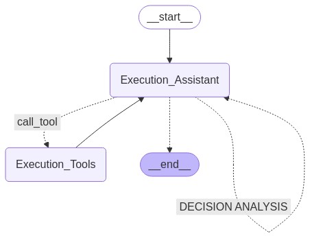

# Bias Agent Project

## Introduction

This project builds a **Text-to-SQL Agent**.

### Structure:
The project mainly consists of:
- **Execution_Assistant node**
- **Execution_Tools node**

Below is a graphical representation of the project structure:



## File Descriptions

- **main.py**:
- **agent.py**: Manages the core execution flow of the Text-to-SQL Agent
- **agent_node_factory.py**: Defines the structure and behavior of the agent's nodes
- **tools.py**: Contains various utility tools
- **tool_test.py**: Provides a test environment to verify the functionality of tools used in the project
- **prompts.yaml**: Contains the system message that defines the behavior and instructions for the Text-to-SQL Agent
- **requirements.txt**: Contains the required dependencies for running the project.
- **source_files**: Stores files that the agent needs prior to running.
- **generated_files**: Stores files generated by the agent during the execution of the project.
- **logs**:

## Usage

### Setup (Windows only)


Run the following command to install all required dependencies listed in `requirements.txt`:

```bash
pip install -r requirements.txt
```


Next, create a `.env` file in the root directory by running the following command:

```bash
echo. > .env
```

Then, open the `.env` file and include the following environment variables:

```bash
OPENAI_API_KEY=your_openai_key_here
LANGCHAIN_API_KEY=your_langchain_key_here
LANGCHAIN_TRACING_V2=true
LANGCHAIN_PROJECT=Multi-agent Collaboration
```


### Running the Agent

To run the Text-to-SQL Agent, use the following command:

```bash
python main.py
```

### For Developers

If you want to test whether the tools are functioning correctly, modify the `tool_test.py` file as needed and run:

```bash
python tool_test.py
```
